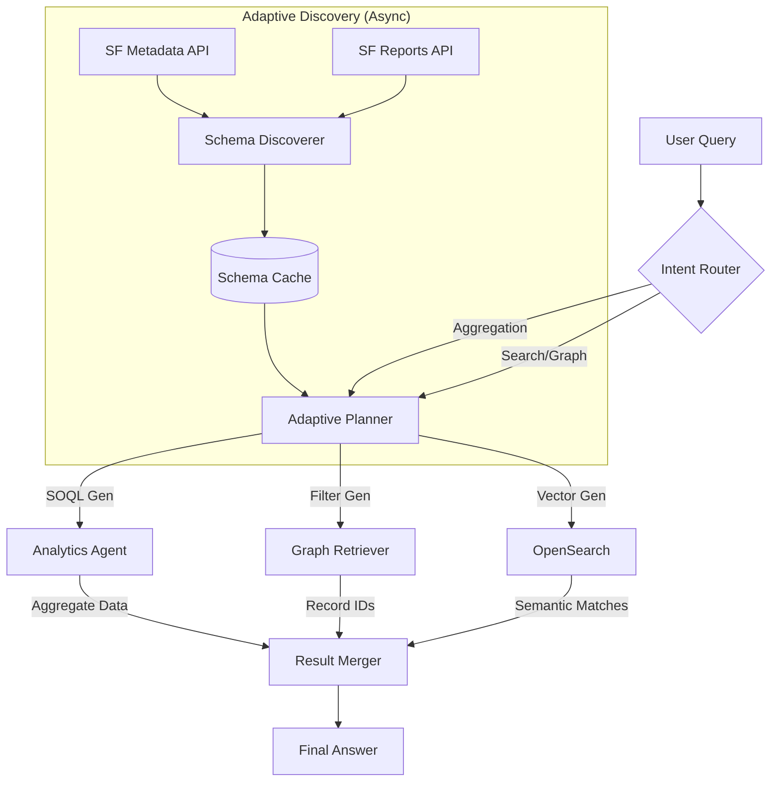

# Graph-Aware Zero-Config Retrieval — Option C (Adaptive Planner with Analytics Agent)

## 1. Objective
Deliver a highly adaptive, "Zero-Config" AI search solution that intelligently bridges the gap between semantic search, graph traversal, and analytical queries. **Option C** extends the deterministic planner (Option A) and manual configuration (Option B) by introducing a dedicated **Analytics Agent** and leveraging rich **Schema & Usage Discovery** to dynamically learn user intent without manual mapping.

## 2. Success Metrics
*   **Query Capability:** 95% coverage of the 20 critical CRE scenarios (including aggregations and multi-hop).
*   **Adaptive Accuracy:** "Zero-Config" precision ≥ 0.85 for fields discovered via Report/Layout analysis (vs. hardcoded regex).
*   **Latency:**
    *   Standard Search: P95 ≤ 1.0s
    *   Analytical/Aggregated: P95 ≤ 3.0s
*   **Freshness:** Schema updates reflected in < 24 hours; Data updates < 10 minutes.
*   **User Experience:** < 5% "No Result" rate for valid queries; Disambiguation used only when necessary (< 15% of queries).

## 3. Scope (In)
*   **Enhanced Schema Discovery:** Automatically ingest `analytics/reports` and `describe/layouts` to score field relevance (`relevance_score`) and discover aggregation patterns.
*   **Adaptive Query Planner:** LLM-driven decomposer that uses the discovered schema (and relevance scores) to map natural language to:
    *   Structured Filters (OpenSearch)
    *   Graph Traversals (DynamoDB)
    *   **Analytical Queries (SOQL)**
*   **Analytics Agent:** A new tool capable of executing `COUNT`, `GROUP BY`, and `SUM` queries against Salesforce data to answer questions like "Companies with > 10 properties."
*   **Hybrid Execution:** Seamlessly merge results from Vector Search, Graph Traversal, and Analytics Agent.
*   **Dynamic Prompt Injection:** Inject high-relevance fields (discovered from layouts/reports) into the LLM system prompt dynamically.

## 4. Out of Scope
*   **Write Capabilities:** The agent will *read* and *analyze* data, not modify records.
*   **Real-time Report Generation:** The agent generates *answers* based on data, not full PDF/Excel reports.
*   **Third-Party Data Sources:** Scope limited to Salesforce + AWS Bedrock/OpenSearch.

## 5. Functional Requirements

### R1. Adaptive Schema Discovery ("The Reader")
*   **Mechanism:** Extend `SchemaDiscoverer` to poll:
    *   `analytics/reports`: Identify fields used as "Groupings" and "Columns" in recent reports.
    *   `describe/layouts`: Identify fields present on "Compact" and "Main" layouts.
*   **Output:** A `relevance_score` for every field (e.g., `ReportUsage * 5 + LayoutPresence * 1`).
*   **Storage:** Persist rich metadata in `SchemaCache` (DynamoDB).

### R2. Analytics Agent ("The Analyst")
*   **Capability:** A secure, read-only interface to execute dynamic SOQL aggregations.
*   **Supported Operations:** `COUNT`, `SUM`, `AVG`, `MAX`, `MIN`, `GROUP BY`.
*   **Guardrails:** Strict query timeouts, result limits, and field-level security (FLS) checks.
*   **Integration:** Callable by the `QueryPlanner` when intent is classified as `AGGREGATION` or `COMPARATIVE`.

### R3. Adaptive Planner & Routing
*   **Input:** User query + Discovered Schema (High-relevance fields only).
*   **Logic:**
    *   If query implies counting/summarizing ("how many", "top 10", "more than X") -> Route to **Analytics Agent**.
    *   If query implies relationships ("deals for...", "tenants in...") -> Route to **Graph Retriever**.
    *   If query implies semantic search ("notes about...", "terms like...") -> Route to **Vector Search**.
*   **Zero-Config:** The planner uses the *discovered* field labels and types, not hardcoded patterns.

### R4. Execution & Merging
*   **Aggregated Results:** Formatted as natural language summaries (e.g., "There are 5 companies with more than 10 properties...").
*   **List Results:** Merged from Graph and Vector paths (as per Option A).
*   **Traceability:** Response includes "Thought Process" (e.g., "Identified 'Class A' from Page Layout as a key filter").

## 6. Architecture Diagram

## 7. Implementation Roadmap (Phased)

### Phase 1: Discovery Upgrade (Weeks 1-2)
*   Implement `_discover_report_usage` and `_discover_layout_visibility`.
*   Update `SchemaCache` to store `relevance_score` and aggregation capability flags.
*   **Goal:** The system "knows" that `ascendix__TotalSquareFeet__c` is important because it's on the main layout.

### Phase 2: Analytics Agent Foundation (Weeks 3-4)
*   Build the `AnalyticsTool` (Lambda/Apex) to execute safe dynamic SOQL.
*   Implement the `AGGREGATION` intent in the `QueryIntentRouter`.
*   **Goal:** System can answer "Count active deals" (Simple Aggregation).

### Phase 3: Adaptive Planner Integration (Weeks 5-6)
*   Update `prompt_generator.py` to inject high-relevance fields dynamically.
*   Connect Planner to `AnalyticsTool` for complex queries ("Companies with > 10 properties").
*   **Goal:** System answers Scenario #8 and #6 ("Hot Leads").

### Phase 4: Refinement & Security (Weeks 7-8)
*   Tune relevance scoring algorithms.
*   Implement strict FLS checks for the Analytics Agent.
*   **Goal:** Production readiness.

## 8. Risk & Mitigation

| Risk | Probability | Mitigation |
| :--- | :--- | :--- |
| **Hallucinated SOQL** | Medium | Constrain Agent to only query fields present in `SchemaCache`. Strict syntax validation. |
| **Slow Discovery** | Low | Run discovery asynchronously (nightly) via EventBridge/Step Functions. |
| **API Limits** | Medium | Cache report metadata aggressively. Only query layouts on change. |
| **Security (Aggregation)** | High | Enforce FLS at the query generation level. Deny-list sensitive objects (User, AuthConfig). |

## 9. Recommendation
**Option C** is the recommended path. It directly addresses the "Aggregation Gap" identified in the capability matrix while fulfilling the "Zero-Config" promise by leveraging Salesforce's own metadata (Reports/Layouts) as the source of truth for user intent. This creates a system that *learns* from how users are already using Salesforce.
